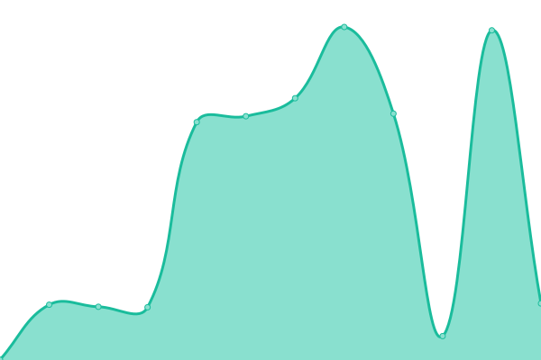

# [📈 Live Status](https://monitor.usarral.com): <!--live status--> **🟩 All systems operational**

This repository contains the open-source uptime monitor and status page for [Carlos Sesma](usarral.com), powered by [Upptime](https://github.com/upptime/upptime).

With [Upptime](https://upptime.js.org), you can get your own unlimited and free uptime monitor and status page, powered entirely by a GitHub repository. We use [Issues](https://github.com/usarral/monitor/issues) as incident reports, [Actions](https://github.com/usarral/monitor/actions) as uptime monitors, and [Pages](https://monitor.usarral.com) for the status page.

<!--start: status pages-->
<!-- This summary is generated by Upptime (https://github.com/upptime/upptime) -->
<!-- Do not edit this manually, your changes will be overwritten -->
<!-- prettier-ignore -->
| URL | Status | History | Response Time | Uptime |
| --- | ------ | ------- | ------------- | ------ |
|  [Usarral.com](https://usarral.com/health) | 🟩 Up | [usarral-com.yml](https://github.com/usarral/monitor/commits/HEAD/history/usarral-com.yml) | 

 902ms
     
 | 

<a href="https://monitor.usarral.com/history/usarral-com">99.42%</a>
    

|  [Usarral.me](https://usarral.me) | 🟩 Up | [usarral-me.yml](https://github.com/usarral/monitor/commits/HEAD/history/usarral-me.yml) | 

 227ms
     
 | 

<a href="https://monitor.usarral.com/history/usarral-me">99.42%</a>
    

|  [The Box Of The Boss](https://theboxoftheboss.com/health.json) | 🟩 Up | [the-box-of-the-boss.yml](https://github.com/usarral/monitor/commits/HEAD/history/the-box-of-the-boss.yml) | 

 476ms
     
 | 

<a href="https://monitor.usarral.com/history/the-box-of-the-boss">100.00%</a>
    

|  [Pedro III](https://pedrotercero.com/health.json) | 🟩 Up | [pedro-iii.yml](https://github.com/usarral/monitor/commits/HEAD/history/pedro-iii.yml) | 

 461ms
     
 | 

<a href="https://monitor.usarral.com/history/pedro-iii">100.00%</a>
    

<!--end: status pages-->

[**Visit our status website →**](https://monitor.usarral.com)

## 📄 License

- Powered by: [Upptime](https://github.com/upptime/upptime)
- Code: [MIT](./LICENSE) © [Anand Chowdhary](https://anandchowdhary.com), supported by [Pabio](https://pabio.com)
- Data in the `./history` directory: [Open Database License](https://opendatacommons.org/licenses/odbl/1-0/)
